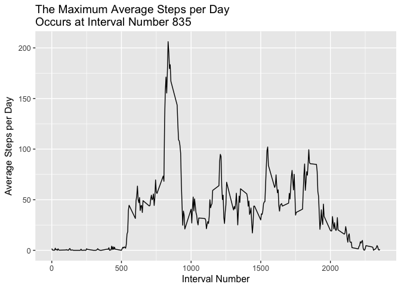

Project1 Reproducible Research
=============================
**Load the data:**

```r
        working.dir <- "/Users/camilla/Projects/ReproducibleResearch/RawData/activity.csv"
        data <- read.csv(file = working.dir)
```

**What is the mean total number of steps taken per day?**
<!-- -->

The mean total number of steps per day is 1.0766\times 10^{4} and the median total steps per day is 10765.

**What is the average daily activity pattern?**
<!-- -->

Interval 835 contains the maximum number of steps.

**Inputing missing values**


The number of missing values in this dataset are 2304. Missing values were replaced with the average numbers of steps for that interval. The average daily value was not used since data for one day was completely missing, therefore no average was available. A new dataset with incomplete data was created and then merged with the average steps per interval using interval idenfifiers. The filled dataset was then added to the complete dataset. See code below.


```r
        #replace missing values
        #create new dataset with only missing values
        data.incomplete <- data[!complete.cases(data),]
        #nrow(data.incomplete) #should be 2304
        #merge missing values dataset with average steps per interval by interval num
        data.fill <- merge(data.incomplete,avgspi, by="interval")[-2]
        #rearrange and rename columns to match complete dataset
        data.fill <- data.fill[,c(3,2,1)]
        colnames(data.fill) <- c("steps","date","interval")
        #append filled in data to complete data
        all.data <- rbind(complete.data,data.fill)
```

**What is the mean total number of steps taken per day with added values?**
<!-- -->

The mean total number of steps per day is 1.0766\times 10^{4} and the median total steps per day is 1.0766\times 10^{4}.

The mean and median values of average steps per day are not largely affected by missing data. The mean steps per day did not change at 1.0766\times 10^{4} steps. The median steps per day changed from 10765 steps to 1.0766\times 10^{4} steps. 

**Are there differences in activity patterns between weekdays and weekends?**

        
<!-- -->

